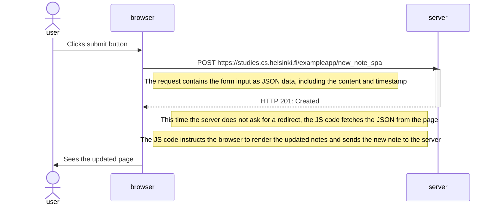

```mermaid
sequenceDiagram
actor user
participant browser
participant server

    user->>browser: Clicks submit button

    browser->>server: POST https://studies.cs.helsinki.fi/exampleapp/new_note_spa
    activate server
    Note right of browser: The request contains the form input as JSON data, including the content and timestamp
    server-->>browser: HTTP 201: Created
    deactivate server


    Note left of server: This time the server does not ask for a redirect, the JS code fetches the JSON from the page


    Note left of server: The JS code instructs the browser to render the updated notes and sends the new note to the server

    browser->>user: Sees the updated page
```
